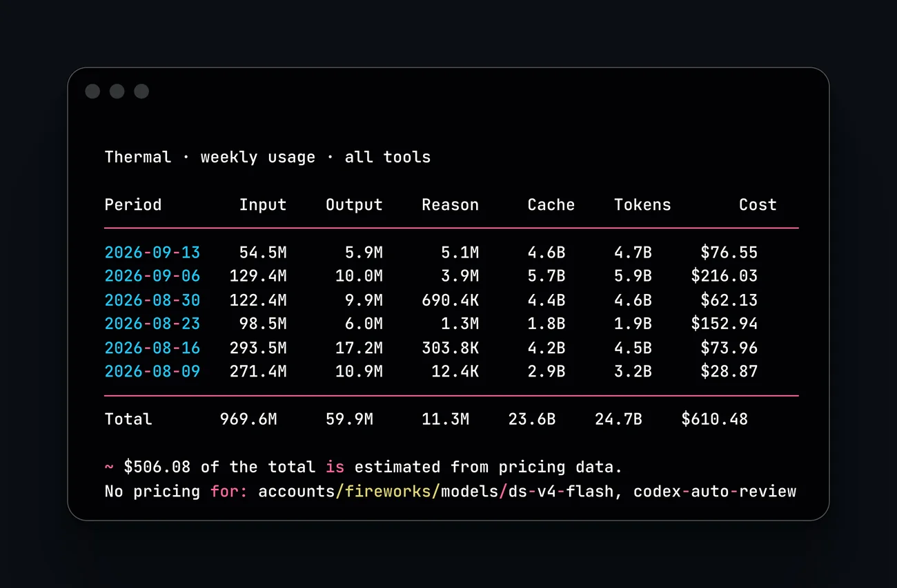
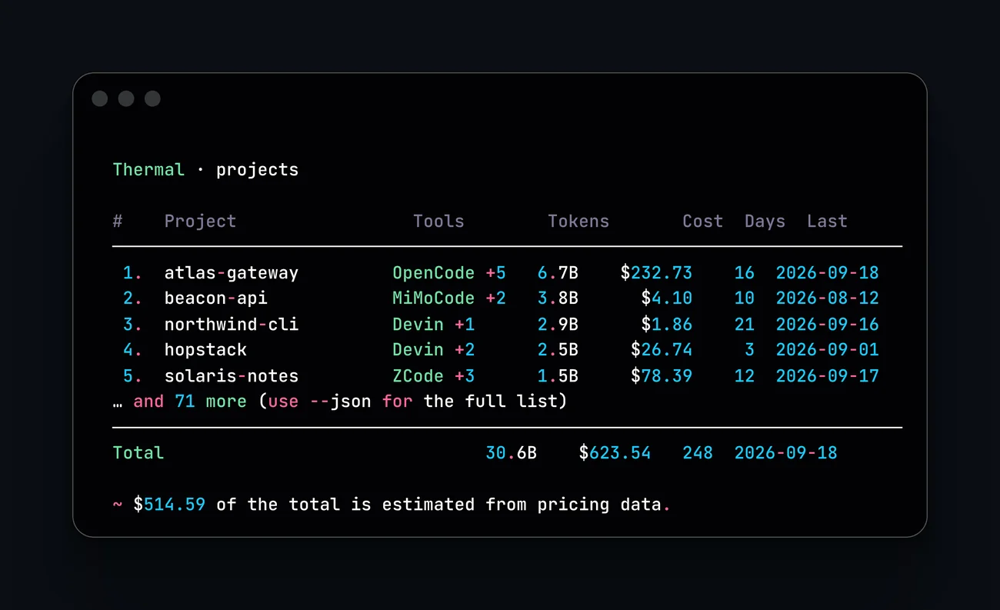

# Thermal

[](https://goreportcard.com/report/github.com/jadmadi/thermal)
[](https://pkg.go.dev/github.com/jadmadi/thermal)
[](https://github.com/jadmadi/thermal/actions/workflows/ci.yml)
[](https://opensource.org/licenses/MIT)

> Don't break the streak.

GitHub-style contribution heatmap for AI coding tools.

See your coding streaks, daily activity, and usage patterns rendered as a beautiful terminal heatmap. Default mode shows a **leaderboard** ranking all your installed tools.

Unlike `git log`, which only shows committed code, thermal shows what your agents actually burned: tokens, cost, and streaks across tools, even when nothing got committed.

```bash
go install github.com/jadmadi/thermal/cmd/thermal@latest
thermal
```


## Supported Tools

| Tool | Data Source | Metrics |
|------|-------------|---------|
| **Devin** | SQLite DB (sessions + message_nodes) | Token usage, sessions, cost |
| **OpenCode** | SQLite DB (v1 and v2 storage) | Token usage, sessions, cost |
| **MiMoCode** | SQLite DB | Token usage, sessions, cost |
| **Codex** | SQLite DB (state_5.sqlite) + rollout JSONL | Token usage, sessions, model/source breakdown |
| **codewhale** | JSON sessions | Token usage, sessions, cost |
| **ZCode** | SQLite DB (`model_usage` telemetry) | Token usage, sessions, model/agent breakdown |
| **Grok** | JSONL session logs (`turn_completed` usage) | Token usage, sessions, cost, model breakdown |
| **Muse** | SQLite session index | Prompt activity, sessions, model breakdown |
| **Claude** | JSONL session transcripts | Token usage, sessions, model breakdown |
| **Droid** | JSONL session transcripts | Message activity, sessions |
| **DeepSeek (DSH)** | JSON session cache (`~/.dsh/storages`) | Token usage, sessions, model breakdown |
| **command-code** | JSONL transcripts | Message activity, sessions, model breakdown |
| **Agy** | Transcript logs (JSONL) | Step activity, sessions, model breakdown |

Tools with token data appear in the **Token Warriors** leaderboard; activity-only tools appear in **Activity Hunters**.

Each tool also accepts short aliases: `mimo`, `oc`, `cmd`, `whale`, `zc`, `ccode`, `dsh`, `deepseek`.

## Install

With Go:

```bash
go install github.com/jadmadi/thermal/cmd/thermal@latest
```

Prefer a hosted page? The documentation site in
[`docs/pages`](docs/pages) covers the same ground with rendered terminal
output: https://thermal.jadmadi.net/

Or download a pre-built binary from [Releases](https://github.com/jadmadi/thermal/releases).

Or build from source using the included build script:

```bash
git clone https://github.com/jadmadi/thermal
cd thermal
./build.sh --release   # Builds stripped production binary (~10.7MB) with embedded version tags
```

You can run `./build.sh --help` to explore available build modes (`--release`, `--dev`, `--upx`) and cross-compilation targets. Or build manually with Go:

```bash
CGO_ENABLED=0 go build -ldflags="-s -w" -trimpath -o thermal ./cmd/thermal
```

## Update

If you installed via binary or `go install`:

```bash
thermal upgrade
```

This checks GitHub for a newer release, downloads the matching binary for your OS/arch, and atomically replaces the running binary.

If you installed via `go install`, you can also update with:

```bash
go install github.com/jadmadi/thermal/cmd/thermal@latest
```

Check your current version:

```bash
thermal version
```

## Usage

```bash
# Default: leaderboard showing all installed tools
thermal

# Show a specific tool's heatmap
thermal --tool opencode
thermal --tool codex
thermal --tool devin

# Auto-detect the first installed tool
thermal --tool auto

# Override the data path for a tool
thermal --tool opencode --db /path/to/opencode.db

# Show last 26 weeks (default: 52, range: 4-104)
thermal --weeks 26

# Output raw JSON
thermal --json

# Enable verbose diagnostic warnings (outputs non-fatal loading errors to stderr)
thermal --verbose

# Disable colors
thermal --no-color
```

The leaderboard ranks by contribution streak. To rank by volume instead:

```bash
thermal --sort tokens   # biggest token consumers first
thermal --sort cost     # biggest recorded spend first
```

## Reports

Daily, weekly, and monthly reports fold the same data into period tables with tokens, cost, and per-model rows:

```bash
# Last 7 days for OpenCode
thermal opencode daily --last 7

# Weekly report for every installed tool
thermal weekly

# A date window (YYYY-MM-DD or YYYYMMDD)
thermal weekly --since 2026-08-01 --until 2026-08-31

# This month, with a row per model
thermal monthly --last 1 --breakdown

# Oldest first, weeks starting on Monday
thermal weekly --order asc --start-of-week monday

# JSON for scripting
thermal weekly --json
```



Daily, weekly, and monthly tables list token-bearing periods only: days with
no classified tokens, no recorded cost, and no model attribution (pure step
or message counts, empty sessions) are skipped so the Tokens column and the
Total row stay in tokens. That activity still counts toward streaks and the
leaderboard.

## Charts

Every report takes `--chart` to print bar rows under the table. The bars are
plain text, so they survive being pasted into a chat, an issue, or a commit
message, where a terminal heatmap does not.

```bash
thermal projects --chart          # bars under the project table
thermal models --chart            # bars plus estimated cost per model
thermal weekly --chart            # one bar per week
thermal weekly --chart --sort cost
```

Each bar prints its number beside it, so nothing depends on colour, and the
caption names the scale. A chart draws its first twelve rows and says how many
it left out, because a bar chart with eighty rows is a second copy of the table
rather than a chart. `--chart` never changes `--json` output.

## The dashboard

`thermal dashboard` opens the same numbers as an interactive screen: Overview,
Projects, Mix, Models and Stats, aggregated from one load of the data.

```bash
thermal dashboard
```

| Key | Does |
|---------|------------------------------------------|
| `q` | quit |
| `1`-`5` | jump to a view |
| `tab` | next view |
| `j` / `k` | move down and up |
| `g` / `G` | first and last row |
| `s` | cycle sort |
| `t` | toggle tokens and cost |
| `r` | cycle range: 30d, 90d, 1y, all |
| `f` | cycle the tool filter (Projects) |
| `v` | mix by tool or model (Mix) |
| `l` | histogram scale (Stats) |
| `enter` | open a project detail |
| `esc` | back |
| `?` | help |

Every view total equals the matching report command for the same window, and a
test asserts that rather than leaving it to inspection. A piped stdout is told
to use the static commands instead, and `--json` never opens a terminal UI.

Cost is estimated for the tools that record none, and the estimated share is
labelled wherever it appears. Day granularity limits switching analysis: a
change that happens twice in one day shows as one switch.

## Projects

Group tokens, cost, and activity by project. thermal walks each recorded directory up to its nearest git repository, so subdirectories and worktrees fold into one project, and the same project is merged across every tool that touched it.

```bash
# Rank every project by tokens
thermal projects

# One tool only
thermal opencode projects

# A window
thermal projects --last 30
thermal projects --since 2026-08-01 --until 2026-08-31

# Rank by something else: cost, days active, or most recent activity
thermal projects --sort cost
thermal projects --sort recent
thermal projects --sort days --order asc

# Tool split and top models under each project
thermal projects --breakdown --top 5

# Limit the printed rows, 0 means all
thermal projects --top 10

# JSON carries every project and the full path
thermal projects --json
```



```
  Thermal · projects

  #    Project                       Tools                    Tokens       Cost  Days  Last
  ───────────────────────────────────────────────────────────────────────────────────────────────
   1.  mahak-bench (Jad)             OpenCode,Devin +4          5.1B    $216.85    14  2026-09-16
        tools   OpenCode 2.9B · Devin 2.0B · Codex 250.3M · +3
        models  deepseek-v4.1-flash 1.4B · muse-spark-1.3-contributor-free 820.4M · +7
   2.  tree.waqf.app                 Devin,MiMoCode +2          3.8B      $4.10    10  2026-08-12
   3.  etba3.app (aqaba-dev)         Codex,Devin,OpenCode     688.8M      $0.07     7  2026-09-07
```

The Project column shows the repository directory name. When two projects share one, the distinguishing parent appears in parentheses, like `mahak-bench (Jad)`. Tools rank by the tokens they contributed, and the breakdown lines show tokens rather than shares because some tools record no model attribution.

Project attribution uses the token tools: OpenCode, MiMoCode, ZCode, Codex, Devin, Claude, Grok, codewhale, and DeepSeek (DSH). Agy records no project.

## Models

Rank models by token volume across every tool, with the tools that used each one.

```bash
# Global ranking
thermal models

# One tool only
thermal opencode models

# A window, or ranking by estimated cost
thermal models --last 30
thermal models --sort cost

# Limit rows, or export
thermal models --top 10
thermal models --json
```

```
  Thermal · models

  #    Model                           Tools                    Tokens       Cost  Days  Last
  ─────────────────────────────────────────────────────────────────────────────────────────────────
   1.  deepseek-v4.1-flash             OpenCode,ZCode             3.9B     $23.29     8  2026-09-17
   2.  deepseek-v4-flash-0731          MiMoCode,OpenCode +1       1.1B     $26.62     9  2026-09-12
   3.  gpt-5.6-sol                     Codex                    386.8M    $256.25    10  2026-09-11
```

Cost in this view is always an estimate from models.dev list prices, because recorded cost belongs to a session or a day, never to one model. Model names are compared case insensitively, so `GLM-5.3-Flash` from ZCode and `glm-5.3-flash` from OpenCode count as one model.

## Analytics: mix, stats, trend

Beyond tabular period reports, Thermal provides three analytical lenses into agent usage:

### `thermal stats`
Daily volume distribution, statistical percentiles (p50/median, p90, mean, max), weekday profile, token composition & cache efficiency, and outlier detection:

```bash
thermal stats
thermal stats --metric cost       # daily spend distribution
thermal opencode stats            # single tool stats
```

```
  Thermal · stats · tokens

  Active days  67
  Total        32.8B
  Mean         489.2M
  Median       306.6M
  p90          1.2B
  Max          2.2B

  Weekday profile
  Sunday          462.5M  ██████████······   10 days
  Monday          451.6M  ██████████······   11 days
  Tuesday         342.8M  ████████········    8 days
  Wednesday       618.9M  ██████████████··   10 days
  Thursday        674.8M  ████████████████   10 days
  Friday          477.2M  ███████████·····    9 days
  Saturday        356.5M  ████████········    9 days

  Token composition
  Cache read           31.3B  ████████████████   95.6%
  Cache write          23.5M  █···············    0.1%
  Uncached input        1.3B  █···············    4.0%
  Output               83.9M  █···············    0.3%
  Reasoning            13.2M  █···············    0.0%
  Cache hit rate: 95.9% of prompt tokens read from cache

  Distribution
       0 — 224.5M  ████████████████████████    28
  224.5M — 449.1M  █████████···············    11
  449.1M — 673.6M  ██████··················     8
  673.6M — 898.2M  ████████················    10
    898.2M — 1.1B  █·······················     2
      1.1B — 1.3B  █·······················     2
      1.3B — 1.6B  █·······················     2
      1.6B — 1.8B  ························     0
      1.8B — 2.0B  ██······················     3
      2.0B — 2.2B  █·······················     1

  Top days
  2026-08-31         2.2B (outlier)
  2026-09-17         2.0B (outlier)
  2026-08-07         1.9B (outlier)
  2026-09-16         1.8B (outlier)
  2026-09-12         1.5B (outlier)

  Outliers above 888.7M (median + 2 MAD): all 5 top days above, plus 5 more
```

### `thermal mix`
Tool or model market-share evolution over time, dominant tool identification, tool switching frequency, and Shannon entropy spread:

```bash
thermal mix                       # tool mix by week
thermal mix --grain month         # monthly mix
thermal mix --by model            # model mix
thermal mix --metric cost         # spend share mix
```

```
  Thermal · mix · by tool · tokens

  Period        Devin         OpenCode      MiMoCode      Codex         other (4)          Total
  ──────────────────────────────────────────────────────────────────────────────────────────────
  2026-07       99%           0%            0%            0%            0%                  1.8B
  2026-08       85%           4%            7%            4%            0%                 16.3B
  2026-09       24%           68%           0%            2%            6%                 14.6B
  ──────────────────────────────────────────────────────────────────────────────────────────────
  Total         59%           32%           4%            3%            3%                 32.8B

  Dominant   Devin
  Switches   24 (2 in 2026-06, 3 in 2026-07, 9 in 2026-08, 10 in 2026-09)
  Spread     0.45 (1 = one tool, 0 = even spread)
```

### `thermal trend`
Ordinary least squares linear regression over daily activity with projection and confidence band to the next period end:

```bash
thermal trend
thermal trend --metric cost
thermal devin trend
```

```
  Thermal · trend · tokens

  Range        2025-09-26 to 2026-09-21
  Days         361
  Mean         90.8M
  Slope        +1.3M per day
  Direction    rising

  Projection to 2026-09-30 (9 days)
  Expected     336.3M
  Band         0 to 855.4M
```

## Where the cost numbers come from

Thermal displays cost figures from two sources:

- **Recorded cost**: What tools wrote directly into their databases (OpenCode, MiMoCode, codewhale, Grok).
- **Estimated cost**: For tools that record tokens and models but no dollar spend (ZCode, Codex, Devin, DeepSeek (DSH), Claude), Thermal estimates cost using current list prices from [models.dev](https://models.dev). Estimated values are prefixed with `~` (for example, `~$24.97` on the leaderboard or `~$20134.07 spent (est)` on single-tool views).

On the default leaderboard, a footer details both amounts:

```
Recorded cost: $118.57 from 4 tools. Estimated: ~$20621.71 across 4 tools (~ prefix).
```

In period reports (`daily`, `weekly`, `monthly`), `projects`, and `models`, Thermal combines recorded and estimated costs into a unified total, disclosing the split in the footer:

```
Total = $118.57 recorded + ~$557.87 estimated from pricing data.
```

To view recorded costs only and skip all estimates, pass `--no-estimate`.

Model cost is always an estimate, because recorded cost belongs to a session or a day and never to one model.

The estimate is not a floor. It covers a day only when the source names a model and that model has a price. Anything else is stated rather than guessed:

- Tokens from a day with no model are counted in the total and named in the footer, so an estimate never reads as complete when part of it could not be priced.
- Models the catalog cannot find are named in the `No pricing for` line rather than counted as free. A tool often records the variant it asked for, such as `claude-sonnet-5-high`, while the catalog prices the base model, so a short list of tier words (`-high`, `-medium`, `-max`, `-mini`, `-fast`, `-eco` and similar) is stripped before the lookup. Only one word is stripped, so two different models can never collapse onto one price.
- A model the catalog genuinely lacks, such as Devin's `swe-1-7`, stays unpriced. Give it a price in `~/.config/thermal/pricing.json` and the total picks it up on the next run.

Tools that record no tokens at all, such as Agy, Droid and command-code, report steps or messages instead. Those counts stay out of token totals and appear in the Activity Hunters leaderboard and in streaks, where they belong.

## Cost estimation

When a source records no cost but names the models (Claude, Codex, ZCode, Devin, DeepSeek (DSH), and Grok turns that used a single model), Thermal estimates spend from the [models.dev](https://models.dev) catalog. Recorded cost always wins over an estimate. Models with no price, including subscription-only models, appear in a "No pricing for" line instead of being treated as free.

```bash
# Cached pricing only, never touch the network
thermal weekly --offline

# Recorded cost only, skip estimates
thermal weekly --no-estimate
```

Pricing is cached at `~/.cache/thermal/pricing.json` and refreshed every 24 hours. Add or correct prices in `~/.config/thermal/pricing.json`:

```json
{
  "codex-auto-review": { "input": 1.25, "output": 10 }
}
```

## Example: Leaderboard

```
  THERMAL  — Don't break the streak.

  Token Warriors
   #    Tool           Strk    Best    Days     Tokens      Cost
   ─────────────────────────────────────────────────────────────────
   1. ZCode              6d      6d      8d   860.3M tok  ~$24.97
   2. Devin              2d     33d     45d   19.2B tok   ~$20134.07
   3. Codex              2d      7d     45d   978.6M tok  ~$462.60
   4. OpenCode           1d     11d     28d   10.5B tok   $61.97
   5. MiMoCode           1d      7d     16d   1.2B tok    $56.14
   6. DeepSeek (DSH)     1d      1d      5d   18.0M tok   ~$0.07
   7. Grok               1d      1d      1d   692.7K tok  $0.44
   8. codewhale          1d      1d      3d   110.1K tok  $0.02
   9. Claude             1d      1d      3d   0 tok       —

  Activity Hunters
   #    Tool           Strk    Best    Days     Activity
   ───────────────────────────────────────────────────────
   1. Agy               40d     40d     47d   76.7K step
   2. command-code       1d      9d     46d   10.8K msg
   3. Droid              1d      1d      2d   14 msg
   4. Muse               1d      1d      1d   1 prompt

  >> Agy is on fire with a 40-day streak!

  Recorded cost: $118.57 from 4 tools. Estimated: ~$20621.71 across 4 tools (~ prefix).

  Keep the heat going. Don't break the streak.
```

## Example: Single Tool


```
  OpenCode activity  1.2B tokens / 8 weeks  ~/.local/share/opencode/opencode.db

      ApMay  J
      ░░█▒░░░░
  Mon ░░█▓░░▒
      ░░▒░░░░█
  Wed █▒▒▒░░░█
      ▓█▓░░░░▓
  Fri ░▒░░░░▓
      ░█▓░░░▒
      Less □░▒▓█ More

  28 active days  |  4 day streak  |  13 best  |  1.6B all-time
```

## How It Works

Thermal reads usage data from installed AI coding tools:

- **Devin**: Queries the Devin CLI SQLite database, joining `message_nodes` (assistant `metadata.metrics` for real input/output/cache token counts) against `sessions` (duration, count) and `prompt_history` (engagement)
- **OpenCode / MiMoCode**: Queries SQLite databases for pre-aggregated token usage, cost, and code diff stats. OpenCode v2 storage reads the `session_v2` table with fallback to the legacy schema
- **Codex**: Reads `state_5.sqlite` (`threads.tokens_used`, model, source, reasoning_effort) as the primary source, supplements with rollout JSONL for the input/output/reasoning/cache token breakdown
- **codewhale**: Reads JSON session files for `metadata.total_tokens`, `metadata.cost.session_cost_usd`, model, and mode
- **command-code**: Parses JSONL session transcripts for message activity and model distribution (from `.meta.json` sidecars)
- **Agy**: Reads `transcript.jsonl` logs from all brain sessions for step activity and model info, with fallback to legacy `overview.txt`
- **ZCode**: Reads the `model_usage` telemetry table (per-request tokens, model, agent; completed runs only) and `turn_usage` for turn counts. The database records no cost figures
- **Grok**: Scans `sessions/*/*/updates.jsonl` for `turn_completed` usage (input/output/reasoning/cache tokens, `costUsdTicks` at 1e-10 USD, per-model `modelCalls`). Input already includes cache reads, reasoning is a subset of output; lifetime uses the recorded `totalTokens`. Honors `GROK_HOME`, falls back to `~/.grok`
- **Muse**: Reads the `session-index.db` session index (prompt counts, model ids, timestamps). Activity-only: the index carries no token or cost telemetry
- **Claude**: Scans `projects/*/*.jsonl` for assistant `message.usage` token counts and model ids. No cost fields exist in transcripts
- **Droid**: Scans `sessions/*/*.jsonl` message records for activity. Session files carry no token or cost telemetry
- **DeepSeek (DSH)**: Reads JSON session cache files from `~/.dsh/storages/session_projcache/sessions/*.json` (and `session_projcache.json`) for fine-grained token usage (`uncachedInputTokens`, `outputTokens`, `cacheReadTokens`, `cacheWriteTokens`), turn counts, and model tracking. Honors `DSH_HOME`, falls back to `~/.dsh`

Loaders also record per-day token types, recorded cost, and the models used, where the source provides them. Period reports fold those day rows.

All SQLite databases are opened **read-only** (`?mode=ro`) with memory-mapped I/O (`PRAGMA mmap_size`) and incremental delta-caching. Multi-file directory and JSONL scanners (`Agy`, `command-code`, `codex`) run concurrently via bounded parallel worker pools with a shared 32 MiB line ceiling (`newJSONLScanner`), reporting non-fatal scan diagnostics to stderr under `--verbose`. Thermal never modifies your data and processes multi-gigabyte historical databases in milliseconds.

## Requirements

- Go >= 1.26

## Author

**Jad Madi** — [jadmadi.net](https://jadmadi.net) · [@jadmadi](https://x.com/jadmadi) · [jadmadi@gmail.com](mailto:jadmadi@gmail.com)

## Support

If you find Thermal useful, consider supporting:

[](https://paypal.me/Madise)

## License

[MIT](LICENSE)
