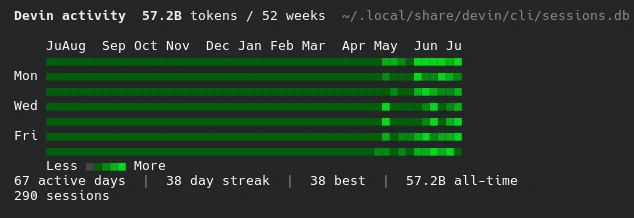
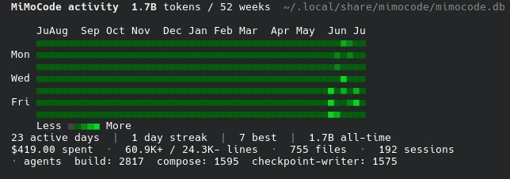
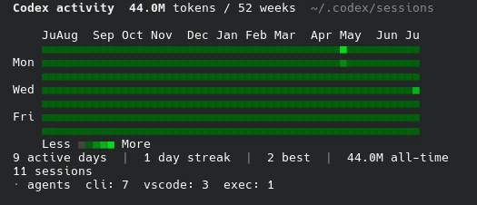
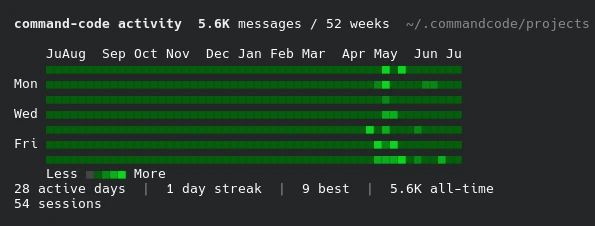
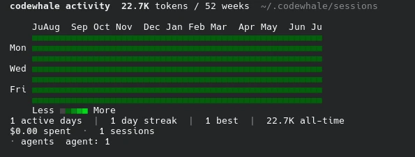

# Thermal

> Don't break the streak.

GitHub-style contribution heatmap for AI coding tools.

See your coding streaks, daily activity, and usage patterns rendered as a beautiful terminal heatmap. Default mode shows a **leaderboard** ranking all your installed tools.


## Supported Tools

| Tool | Data Source | Metrics |
|------|-------------|---------|
| **Devin** | SQLite DB (sessions + message_nodes) | Token usage, sessions, cost |
| **OpenCode** | SQLite DB | Token usage, sessions, cost |
| **MiMoCode** | SQLite DB | Token usage, sessions, cost |
| **Codex** | SQLite DB (state_5.sqlite) + rollout JSONL | Token usage, sessions, model/source breakdown |
| **codewhale** | JSON sessions | Token usage, sessions, cost |
| **command-code** | JSONL transcripts | Message activity, sessions, model breakdown |
| **Agy** | Overview logs (JSONL) | Step activity, sessions, model breakdown |

Tools with token data appear in the **Token Warriors** leaderboard; activity-only tools appear in **Activity Hunters**.

Each tool also accepts short aliases: `mimo`, `oc`, `cmd`/`cc`, `whale`.

## Install

With Go:

```bash
go install github.com/jadmadi/thermal/cmd/thermal@latest
```

Or download a pre-built binary from [Releases](https://github.com/jadmadi/thermal/releases).

Or build from source using the included build script:

```bash
git clone https://github.com/jadmadi/thermal
cd thermal
./build.sh --release   # Builds stripped production binary (~9.8MB) with embedded version tags
```

You can run `./build.sh --help` to explore available build modes (`--release`, `--dev`, `--upx`) and cross-compilation targets. Or build manually with Go:

```bash
CGO_ENABLED=0 go build -ldflags="-s -w" -trimpath -o thermal ./cmd/thermal
```

## Update

If you installed via binary or `go install`:

```bash
thermal upgrade
```

This checks GitHub for a newer release, downloads the matching binary for your OS/arch, and atomically replaces the running binary.

If you installed via `go install`, you can also update with:

```bash
go install github.com/jadmadi/thermal/cmd/thermal@latest
```

Check your current version:

```bash
thermal version
```

## Usage

```bash
# Default: leaderboard showing all installed tools
thermal

# Show a specific tool's heatmap
thermal --tool opencode
thermal --tool codex
thermal --tool devin

# Auto-detect the first installed tool
thermal --tool auto

# Override the data path for a tool
thermal --tool opencode --db /path/to/opencode.db

# Show last 26 weeks (default: 52, range: 4-104)
thermal --weeks 26

# Output raw JSON
thermal --json

# Enable verbose diagnostic warnings (outputs non-fatal loading errors to stderr)
thermal --verbose

# Disable colors
thermal --no-color
```

## Example: Leaderboard

```
  THERMAL  — Don't break the streak.

  Token Warriors
   #    Tool           Strk    Best    Days     Tokens      Cost
   ─────────────────────────────────────────────────────────────────
   1. Devin             38d     38d     67d   57.2B tok   —
   2. OpenCode           2d     10d     46d   1.8B tok    $234.37
   3. MiMoCode           1d      7d     23d   1.7B tok    $419.00
   4. Codex              1d      2d      9d   44.0M tok   —
   5. codewhale          1d      1d      1d   22.7K tok   $0.0032

  Activity Hunters
   #    Tool           Strk    Best    Days     Activity
   ───────────────────────────────────────────────────────
   1. command-code       1d      9d     28d   5.6K msg
   2. Agy                1d      1d      2d   304 step

  >> Devin is on fire with a 38-day streak!

  Keep the heat going. Don't break the streak.
```

## Example: Single Tool







```
  OpenCode activity  1.2B tokens / 8 weeks  ~/.local/share/opencode/opencode.db

      ApMay  J
      ░░█▒░░░░
  Mon ░░█▓░░▒
      ░░▒░░░░█
  Wed █▒▒▒░░░█
      ▓█▓░░░░▓
  Fri ░▒░░░░▓
      ░█▓░░░▒
      Less □░▒▓█ More

  28 active days  |  4 day streak  |  13 best  |  1.6B all-time
```

## How It Works

Thermal reads usage data from installed AI coding tools:

- **Devin**: Queries the Devin CLI SQLite database, joining `message_nodes` (assistant `metadata.metrics` for real input/output/cache token counts) against `sessions` (duration, count) and `prompt_history` (engagement)
- **OpenCode / MiMoCode**: Queries SQLite databases for pre-aggregated token usage, cost, and code diff stats
- **Codex**: Reads `state_5.sqlite` (`threads.tokens_used`, model, source, reasoning_effort) as the primary source, supplements with rollout JSONL for the input/output/reasoning/cache token breakdown
- **codewhale**: Reads JSON session files for `metadata.total_tokens`, `metadata.cost.session_cost_usd`, model, and mode
- **command-code**: Parses JSONL session transcripts for message activity and model distribution (from `.meta.json` sidecars)
- **Agy**: Reads `overview.txt` logs from all brain sessions for step activity, supplements with `transcript.jsonl` for model info

All SQLite databases are opened **read-only** (`?mode=ro`) with memory-mapped I/O (`PRAGMA mmap_size`) and incremental delta-caching. Multi-file directory and JSONL scanners (`Agy`, `command-code`, `codex`) run concurrently via bounded parallel worker pools. Thermal never modifies your data and processes multi-gigabyte historical databases in milliseconds.

## Requirements

- Go >= 1.26

## Author

**Jad Madi** — [jadmadi.net](https://jadmadi.net) · [@jadmadi](https://x.com/jadmadi) · [jadmadi@gmail.com](mailto:jadmadi@gmail.com)

## Support

If you find Thermal useful, consider supporting:

[](https://paypal.me/Madise)

## License

[MIT](LICENSE)
